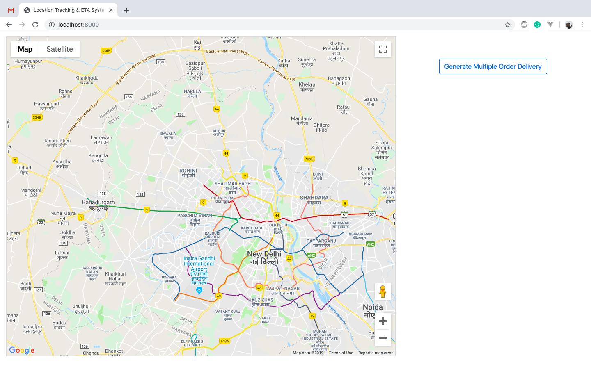
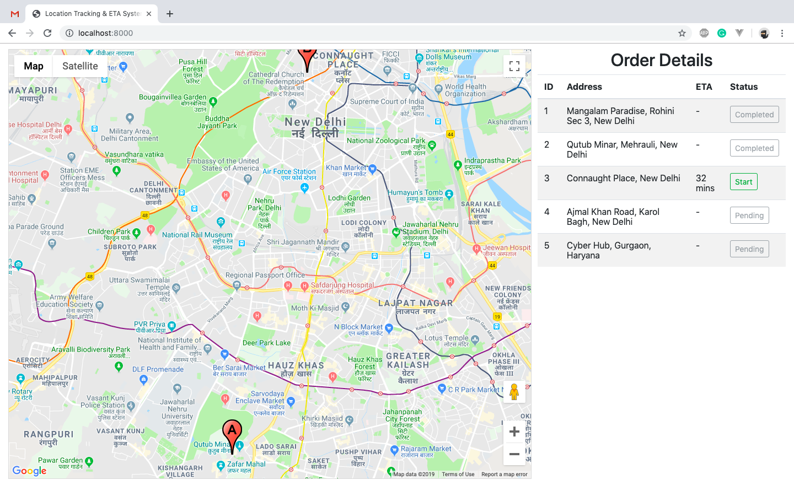
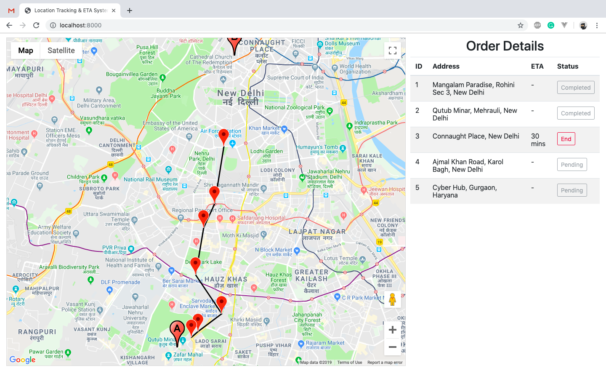

<p align="center">
    <h1 align="center">Location Tracking & ETA System</h1>
    <br>
</p>

Requirement :
<ul>
    <li> php 7.0+
    <li> redis-cli
</ul>

Execution Commands :

<ul>
    <li> composer install
    <li> php -S localhost:8000 -t tracking-eta/
</ul>

<h3>Screenshots</h3>
Landing Page

Source and Destination

Movement



DIRECTORY STRUCTURE
-------------------

```
api/                     the code of all the api
config/                  config and utility file
vendor/                  contains dependent 3rd-party packages
index.php                index page with map
main.js                  all js funcationality
```
